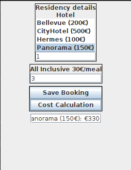

# Residency Cost Calculator

## Description

The Residency Cost Calculator is a Java Swing application that allows users to input details about their residency, including the selected hotel and the number of days stayed and meals ordered. The application calculates the total cost of the residency and provides a user-friendly interface for managing this information.



## Features

- **Hotel Selection**: Choose from a list of available hotels for your residency.
- **Staying Days**: Input the number of days you plan to stay.
- **Meal Selection**: Specify the number of meals (1, 2, or 3) you want to include in your residency package.
- **Calculate Cost**: Calculate the total cost of your residency based on your selections.
- **Save Booking**: Store the cost details of your residency.
- **Cost Calculation**: Calculate the total cost for the selected hotel.
- **User-Friendly Interface**: The application provides a user-friendly and intuitive interface.

## Usage

1. Launch the application by running the `Main` class.
2. Select a hotel from the list.
3. Enter the number of days you plan to stay.
4. Specify the number of meals you want to include.
5. Click the "Save Booking" button to store the cost details.
6. To calculate the total cost for the selected hotel, click the "Cost Calculation" button.

## Requirements

- Java Development Kit (JDK)
- Java Swing library

## Installation

1. Clone the repository to your local machine:

   ```shell
   git clone https://github.com/george313/java-hotel-reservation-system.git
   ```

2. Compile the Java source code:

   ```shell
   javac InputFrame.java
   ```

3. Run the application:

   ```shell
   java InputFrame
   ```

## License

This project is licensed under the [MIT License](LICENSE).

## Contributing

Contributions are welcome! Feel free to open an issue or submit a pull request to improve the application.
